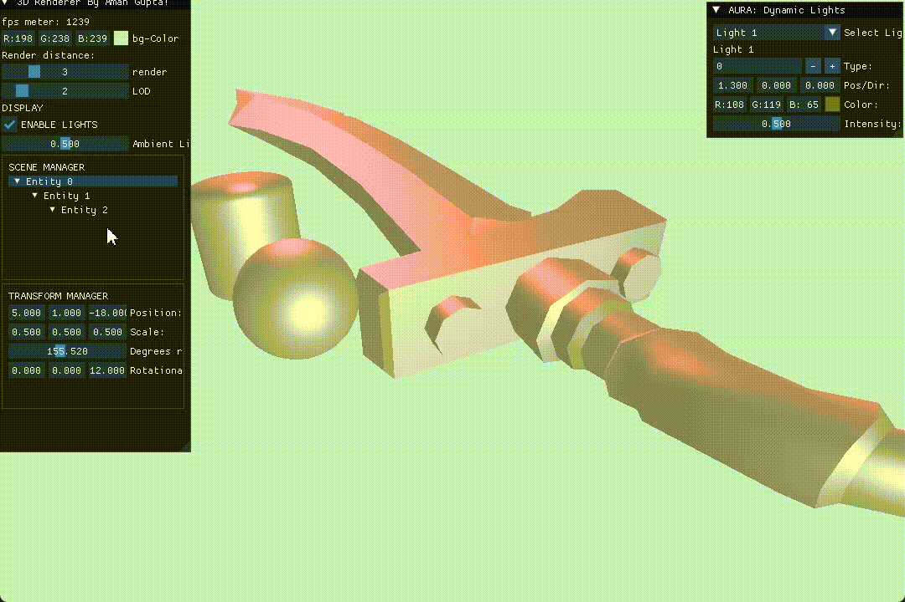

<h1 align="center"> ⚙️ Asthrarisine Engine — A High Performance Graphics Engine Powered by Modern OpenGL 4.6 </h1>

##   Created by Aman Gupta

> A cross-platform, performance-first graphics engine built entirely with modern OpenGL 4.6 utilizing its Graphics Pipeline ,featuring Advanced GPU Instancing by single draw call using 'glMultiDrawIndirectInstanced()' containing ECS-based architecture, and in-editor scene manipulation. Designed for real-time 3D rendering, asset streaming, and extensibility.

---

## 🚀 Tech Stack & Libraries

| Library     | Role in the Engine |
|-------------|---------------------|
| **OpenGL 4.6** | The rendering backbone. Utilizes core profile, DSA (Direct State Access), persistent buffers, and `glMultiDrawElementsIndirect()` for batching thousands of draw calls into one — massively reducing CPU overhead. |
| **GLAD**     | Efficient OpenGL loader — generates modern function pointers based on your desired spec. |
| **GLFW**     | Cross-platform window and input handler — handles OpenGL context creation, input callbacks, and high-resolution timing. |
| **GLM**      | Mathematics library that mimics GLSL syntax — powers all transformations, projections, and camera logic. |
| **ImGui**    | Immediate Mode GUI for real-time editor tools — enables on-the-fly tweaking of entity properties, camera, and renderer settings. |
| **tinygltf** | Native glTF 2.0 loader — efficiently parses mesh data, transforms, and scene nodes without external dependencies like Assimp. |

---

##  Architecture Highlights

###  **Entity-Component-System (ECS)**
- Designed around **data-oriented programming** principles.
- Entities are simple IDs.
- Components are POD structures stored in flat hash maps.
- Systems iterate efficiently over matching components.

###  **Scene Hierarchy**
- Each entity can parent others, enabling full transform propagation.
- Scene graph logic supports:
  - World/Local matrix decomposition
  - Real-time updates through ImGui
  - Instancing and prefab-like composition

###  **Dynamic GPU Updates via ImGui**
- Entity transforms are controlled through ImGui sliders in real-time.
- Transform buffers are updated using persistent-mapped UBOs or SSBOs.
- Enables **live editing** without recompiling shaders or re-uploading meshes.

###  **Arcball Camera**
- Mouse-controlled camera with orbit, pan, and zoom.
- Implements quaternion-based arcball rotation.
- Perfect for 3D editors, model viewers, and level design tools.

###  **Renderer Class**
- Central abstraction layer for all OpenGL operations.
- Manages:
  - Shader binding
  - Buffer uploads
  - Multi-pass rendering
  - Instanced rendering pipelines
- Supports **`glMultiDrawElementsIndirect()`**, allowing thousands of meshes to be drawn in a single call.

---
## Build Instruction
```bash
mkdir build
cd build

# Configure with MSVC generator
cmake <project location {..} > -G "Visual Studio 17 2022" -A x64 -DCMAKE_BUILD_TYPE=Release

# Build with static runtime already forced
cmake --build . --config Release
```

##  Features at a Glance

- ⚡ **Modern OpenGL 4.6 Core** — DSA, persistent mapping, bindless-ready
- 🧠 **ECS Scene Management** — scalable and decoupled
- 🖱️ **Arcball Editor Camera** — intuitive mouse controls
- 📊 **Real-time UI Editing** — ImGui-backed transform and entity control
- 🧱 **glTF Loader** — native support for meshes and transform hierarchies
- 🎮 **Renderer Abstraction** — clean interface for rendering logic and draw call submission
- 🔁 **Multi-Draw Instancing** — significant draw call reduction for large scenes


Inspired by: TheCherno's Hazel Engine

